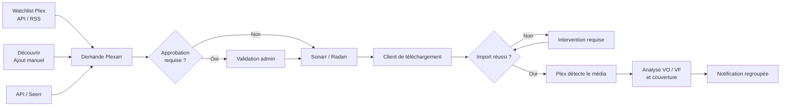
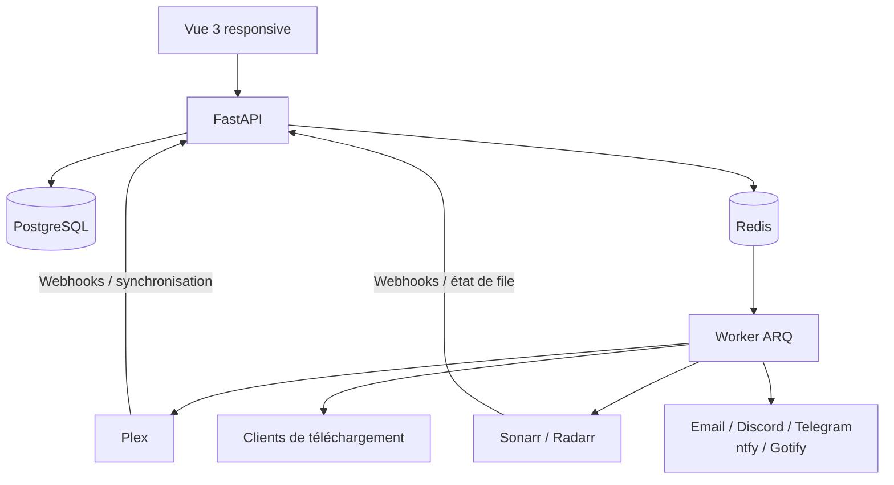

# Plexarr

[](https://github.com/remi-deher/plex-rss/actions/workflows/tests.yml)
[](https://github.com/remi-deher/plex-rss/actions/workflows/e2e.yml)
[](https://github.com/remi-deher/plex-rss/actions/workflows/docker-publish.yml)
[](https://hub.docker.com/r/mrcryllix/plex-rss)
[](LICENSE)

**Plexarr est un hub self-hosted de demandes, d’acquisition et de disponibilité pour Plex et l’écosystème \*arr.**

Il collecte les demandes provenant des watchlists Plex, de l’API, de l’interface ou de Seerr, les transmet à Sonarr/Radarr, surveille les téléchargements et les imports, confirme la disponibilité dans Plex, analyse les versions VO/VF puis notifie les utilisateurs sans multiplier les messages.

> [!NOTE]
> Le projet s’appelait auparavant *Plex RSS Monitor*. Le dépôt et l’image conservent le nom technique `plex-rss`, mais l’application s’appelle désormais **Plexarr**.

## Sommaire

- [Ce que fait Plexarr](#ce-que-fait-plexarr)
- [Workflow média](#workflow-média)
- [Architecture](#architecture)
- [Installation Docker](#installation-docker)
- [Premier démarrage](#premier-démarrage)
- [Configuration des intégrations](#configuration-des-intégrations)
- [Exploitation](#exploitation)
- [Dépannage](#dépannage)
- [Sauvegarde et restauration](#sauvegarde-et-restauration)
- [Mise à jour](#mise-à-jour)
- [Développement](#développement)

## Ce que fait Plexarr

### Demandes et orchestration

- Entrées depuis la **Watchlist Plex API**, un flux **RSS Plex**, l’API Plexarr, l’interface Découvrir ou **Overseerr/Jellyseerr**.
- Routage direct vers plusieurs instances **Sonarr** et **Radarr**.
- Approbation facultative, co-demandeurs et historique de la provenance.
- Recherche de releases via Prowlarr et ajout direct à un client compatible.
- Prise en charge des séries complètes, de quelques saisons ou d’un épisode unique.

### Téléchargements et imports

- File unifiée Sonarr/Radarr et clients directs.
- Progression, temps restant, état opérationnel et raison d’attente.
- Détection d’un téléchargement terminé mais bloqué à l’import.
- Confirmation après deux contrôles consécutifs pour limiter les faux blocages.
- Association et import manuels depuis l’interface.

### Disponibilité Plex et langues

- Séparation claire entre demande, transmission \*arr, téléchargement, import et disponibilité Plex.
- Synchronisation des médias déjà présents dans Plex.
- Couverture par saison et épisode.
- Analyse VO, VF, VF secondaire et disponibilité partielle.
- Gestion des films, séries complètes, saisons complètes et épisodes isolés.

### Notifications

- Email SMTP, Discord, Telegram, ntfy et Gotify.
- Modèles personnalisables avec aperçu et simulation par utilisateur.
- Jalons regroupés pour éviter un email par saison lors de l’ajout d’une série complète.
- Notifications de demande, disponibilité, amélioration VF, correction et échec.
- Historique par média et par utilisateur, avec canal, destinataire et résultat.
- Bascule globale permettant de bloquer les envois sans interrompre l’analyse.

### Interface responsive

- Sidebar repliable sur ordinateur et tablette, navigation mobile avec safe areas.
- Dashboard et activité sur 30 jours par demandes, disponibilités ou notifications.
- Bibliothèque avec filtres compacts.
- Calendrier Agenda/Mois et téléchargements regroupés par action requise.
- Fiches média avec timeline, couverture, prochaines sorties, demandes et notifications.
- Paramètres avec vue d’ensemble et recherche.
- Centre d’exploitation, maintenance, journaux et incidents.
- Gestion des utilisateurs, permissions, notifications et activité.

## Workflow média



Le point d’entrée est conservé pendant tout le parcours. Une demande API ou Watchlist portant sur une série implique toutes les saisons hors saison 0, tandis qu’une demande manuelle peut cibler seulement certaines saisons ou un épisode.

## Architecture



| Composant | Rôle |
|---|---|
| `plex-rss` | API FastAPI, interface Vue, webhooks et événements temps réel |
| `worker` | Jobs ARQ, polling, analyse, notifications et traitements longs |
| `db` | PostgreSQL 15 et données métier |
| `redis` | File ARQ, heartbeat, cache et signaux temps réel |
| `backup` / `restore` | Outils PostgreSQL activés par le profil Compose `operations` |

## Installation Docker

### Prérequis

- Docker Engine 24+ ou Docker Desktop récent.
- Docker Compose v2.
- Un répertoire persistant pour `data/` et `backups/`.

### 1. Récupérer la configuration

```bash
git clone https://github.com/remi-deher/plex-rss.git
cd plex-rss
cp .env.example .env
```

Sous PowerShell :

```powershell
Copy-Item .env.example .env
```

### 2. Générer les secrets

Définissez dans `.env` un mot de passe PostgreSQL long, puis générez la clé de chiffrement :

```bash
python -c "from cryptography.fernet import Fernet; print(Fernet.generate_key().decode())"
```

```dotenv
TZ=Europe/Paris
POSTGRES_DB=plexrss
POSTGRES_PASSWORD=remplacer-par-un-secret-long
PLEXARR_ENCRYPTION_KEY=coller-la-cle-fernet
ARQ_MAX_JOBS=4
ARQ_JOB_TIMEOUT=3600
BACKUP_RETENTION_DAYS=14
```

> [!CAUTION]
> Conservez `PLEXARR_ENCRYPTION_KEY`. La perdre empêche de déchiffrer les secrets déjà enregistrés. Ne publiez jamais votre fichier `.env`.

### 3. Démarrer

Le fichier du dépôt construit l’image locale :

```bash
docker compose up -d --build
docker compose ps
```

L’application est ensuite disponible sur [http://localhost:8000](http://localhost:8000).

Pour utiliser uniquement l’image publiée, remplacez `build: .` par :

```yaml
image: mrcryllix/plex-rss:latest
```

dans les services `plex-rss` et `worker`.

> [!TIP]
> `latest` suit `main` et change à chaque merge : pratique pour un usage personnel, plus risqué en production car une régression est livrée dès le prochain `docker compose pull`. Pour un déploiement stable, préférez épingler une version taguée (`vX.Y.Z`, construite depuis un tag Git) et ne montez de version qu’après avoir lu le [changelog](CHANGELOG.md). Les images sont publiées à la fois sur Docker Hub (`mrcryllix/plex-rss`) et GitHub Container Registry (`ghcr.io/remi-deher/plex-rss`), seule l’architecture `linux/amd64` est construite pour le moment.

### Déploiement minimal complet

```yaml
services:
  plex-rss:
    image: mrcryllix/plex-rss:latest
    ports: ["8000:8000"]
    volumes: ["./data:/app/data"]
    env_file: [.env]
    environment:
      DATABASE_URL: postgresql://plexrss:${POSTGRES_PASSWORD}@db:5432/${POSTGRES_DB:-plexrss}
      REDIS_URL: redis://redis:6379/0
      ENABLE_ARQ: "1"
      ENABLE_LEGACY_SCHEDULER: "0"
    depends_on:
      db: { condition: service_healthy }
      redis: { condition: service_healthy }
    restart: unless-stopped

  worker:
    image: mrcryllix/plex-rss:latest
    command: ["arq", "app.jobs.WorkerSettings"]
    volumes: ["./data:/app/data"]
    env_file: [.env]
    environment:
      DATABASE_URL: postgresql://plexrss:${POSTGRES_PASSWORD}@db:5432/${POSTGRES_DB:-plexrss}
      REDIS_URL: redis://redis:6379/0
      ENABLE_ARQ: "1"
    depends_on:
      plex-rss: { condition: service_healthy }
    restart: unless-stopped

  db:
    image: postgres:15-alpine
    environment:
      POSTGRES_USER: plexrss
      POSTGRES_PASSWORD: ${POSTGRES_PASSWORD}
      POSTGRES_DB: ${POSTGRES_DB:-plexrss}
    volumes: ["pgdata:/var/lib/postgresql/data"]
    healthcheck:
      test: ["CMD-SHELL", "pg_isready -U plexrss -d ${POSTGRES_DB:-plexrss}"]
      interval: 10s
      timeout: 5s
      retries: 5
    restart: unless-stopped

  redis:
    image: redis:7-alpine
    command: redis-server --appendonly yes
    volumes: ["redisdata:/data"]
    healthcheck:
      test: ["CMD", "redis-cli", "ping"]
      interval: 10s
      timeout: 5s
      retries: 5
    restart: unless-stopped

volumes:
  pgdata:
  redisdata:
```

## Premier démarrage

1. Ouvrez l’application et créez le compte propriétaire.
2. Dans **Paramètres → Vue d’ensemble**, vérifiez les sections incomplètes.
3. Configurez Plex, puis Sonarr/Radarr et leurs dossiers racines.
4. Synchronisez les utilisateurs Plex.
5. Configurez au moins un canal de notification.
6. Lancez les tests de connexion depuis l’interface.
7. Ajoutez les webhooks pour réduire le délai de détection.

## Configuration des intégrations

### Webhooks

Utilisez une URL Plexarr accessible depuis les conteneurs ou serveurs sources :

| Source | URL | Événements utiles |
|---|---|---|
| Sonarr | `https://plexarr.example.com/webhook/sonarr` | Download / Import / Upgrade |
| Radarr | `https://plexarr.example.com/webhook/radarr` | Download / Import / Upgrade |
| Plex | `https://plexarr.example.com/webhook/plex` | `library.new`, événements média |

Le polling reste actif comme mécanisme de rattrapage. Le webhook Plex nécessite un abonnement Plex Pass.

### Reverse proxy

Le proxy doit transmettre `Host`, `X-Forwarded-For` et `X-Forwarded-Proto`, autoriser les webhooks et ne pas mettre en cache `/api/events`, qui utilise SSE.

### Stockage et permissions

- `pgdata` contient la base PostgreSQL.
- `redisdata` conserve Redis en mode AOF.
- `./data` conserve la clé de session et les éventuelles données de migration SQLite.
- `./backups` reçoit les dumps PostgreSQL.

## Exploitation

### Vérifications rapides

```bash
docker compose ps
docker compose logs --tail=100 plex-rss
docker compose logs --tail=100 worker
docker compose exec worker arq --check app.jobs.WorkerSettings
docker compose exec redis redis-cli ping
docker compose exec db pg_isready -U plexrss -d plexrss
```

| Endpoint | Usage |
|---|---|
| `/api/health` | Santé de Plex, des instances \*arr et de l’infrastructure |
| `/api/metrics/prometheus` | Métriques Prometheus, Redis, worker et files |
| `/api/events` | Flux SSE authentifié pour le rafraîchissement temps réel |

Dans l’interface, consultez **Exploitation → Vue d’ensemble** avant les logs : les imports bloqués, conflits et actions recommandées y sont regroupés.

### États attendus

```text
plex-rss   healthy
worker     healthy
db         healthy
redis      healthy
```

Si le worker est indisponible, l’interface peut rester accessible mais le polling, les analyses et les notifications différées ne progresseront plus.

## Dépannage

### `plex-rss` reste "unhealthy", le worker ne démarre jamais

Le worker dépend de `plex-rss: { condition: service_healthy }` : tant que l’API n’est pas saine, il ne tente même pas de démarrer. Commencez toujours par les logs de l’API :

```bash
docker compose logs --tail=200 plex-rss
```

La cause la plus fréquente est une migration Alembic qui échoue au démarrage (les migrations s’appliquent avant que l’API n’écoute).

### La migration échoue avec `DuplicateTable` / "already exists" à chaque nouvelle tentative

Signe qu’une tentative de migration précédente a été interrompue (redémarrage concurrent, arrêt brutal) après avoir partiellement appliqué un changement de schéma, mais sans que `alembic_version` n’ait avancé — chaque redémarrage rejoue donc la même migration et échoue de la même façon puisque l’objet existe déjà.

1. Identifiez l’objet en doublon dans le message d’erreur (index, colonne, contrainte…).
2. Connectez-vous à PostgreSQL et vérifiez l’état réel :
   ```bash
   docker compose exec db psql -U plexrss -d plexrss -c "\d nom_de_la_table"
   docker compose exec db psql -U plexrss -d plexrss -c "SELECT version_num FROM alembic_version;"
   ```
3. Si l’objet listé dans l’erreur existe déjà mais que `alembic_version` n’a pas avancé jusqu’à la révision qui le crée, supprimez uniquement cet objet en doublon (`DROP INDEX ...`, jamais `DROP TABLE`) pour laisser la migration le recréer proprement au prochain démarrage.
4. Relancez `docker compose up -d plex-rss` : la boucle de retry du conteneur doit alors passer la migration et repasser "healthy".

Les migrations ajoutées depuis juillet 2026 utilisent `CREATE INDEX IF NOT EXISTS` / `DROP INDEX IF EXISTS` pour rester rejouables sans intervention manuelle ; ce scénario ne devrait plus se reproduire pour les futures migrations d’index.

### Le worker est "healthy" mais rien ne se traite

Vérifiez que `ENABLE_ARQ=1` est bien défini sur les deux services et que Redis répond (`docker compose exec redis redis-cli ping`). Un worker qui ne peut pas joindre Redis au démarrage peut rester marqué sain par son propre healthcheck tout en ne consommant aucune tâche.

## Sauvegarde et restauration

Créer et vérifier un dump :

```bash
docker compose --profile operations run --rm backup
```

Restaurer un dump nécessite d’arrêter les services qui écrivent :

```bash
docker compose stop plex-rss worker
RESTORE_FILE=plexarr-YYYYMMDDTHHMMSSZ.dump CONFIRM_RESTORE=YES \
  docker compose --profile operations run --rm restore
docker compose up -d plex-rss worker
```

Testez régulièrement une restauration. Un fichier de sauvegarde qui n’a jamais été restauré ne constitue pas une sauvegarde vérifiée.

## Mise à jour

### Image publiée

```bash
docker compose --profile operations run --rm backup
docker compose pull
docker compose up -d
docker compose ps
```

### Construction locale

```bash
git pull --ff-only
docker compose --profile operations run --rm backup
docker compose up -d --build
```

Les migrations Alembic sont appliquées au démarrage de l’API. Consultez les logs avant de considérer la mise à jour terminée.

### Migration d’une ancienne base SQLite

Le compose conserve `AUTO_MIGRATE_LEGACY_SQLITE=1` et `LEGACY_SQLITE_PATH=/app/data/plex_rss.db`. L’import n’a lieu que si PostgreSQL est vide. Conservez une copie du fichier SQLite avant le premier démarrage et consultez [la documentation de migration](docs/LEGACY_DATABASE_MIGRATION.md).

## Développement

### Backend

```bash
python -m venv .venv
# Linux/macOS : source .venv/bin/activate
# PowerShell   : .venv\Scripts\Activate.ps1
pip install -r requirements.txt -r requirements-dev.txt
alembic upgrade head
uvicorn app.main:app --reload
```

### Frontend

```bash
npm ci
npm run dev
npm run build
npm run test:e2e
```

### Tests et qualité

```bash
python -m pytest -q -p no:xonsh -p no:xonsh.pytest.plugin
python -m ruff check .
```

Les contributions sont décrites dans [CONTRIBUTING.md](CONTRIBUTING.md). Pour l’exploitation détaillée, consultez [docs/OPERATIONS.md](docs/OPERATIONS.md).

## Sécurité

- Ne publiez jamais `.env`, les tokens Plex/\*arr ou les clés de notification.
- Placez Plexarr derrière HTTPS pour un accès distant.
- Limitez l’exposition directe de PostgreSQL et Redis : aucun port hôte n’est nécessaire.
- Sauvegardez `PLEXARR_ENCRYPTION_KEY` séparément des dumps PostgreSQL.
- Consultez les alertes Dependabot, CodeQL et Trivy avant une mise à jour majeure.

## Licence

[MIT](LICENSE) — Copyright © 2026 Rémi DEHER.
