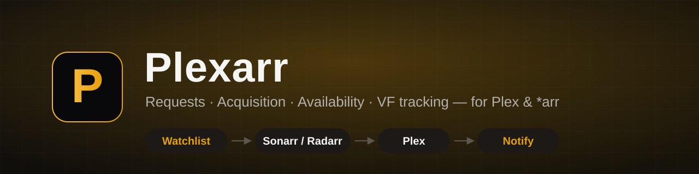
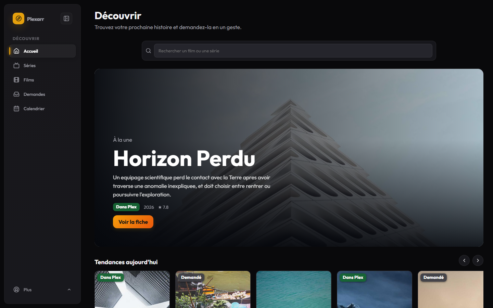
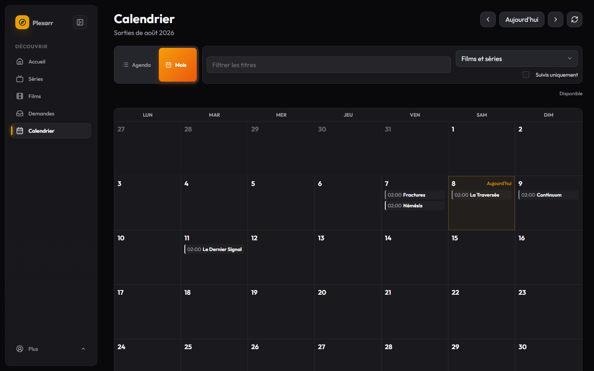
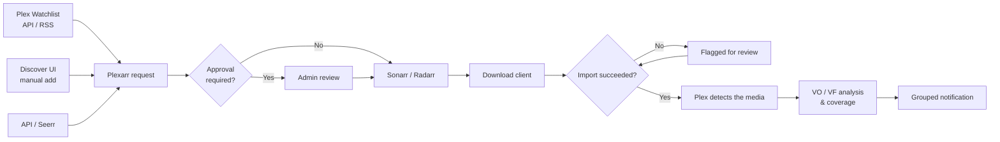
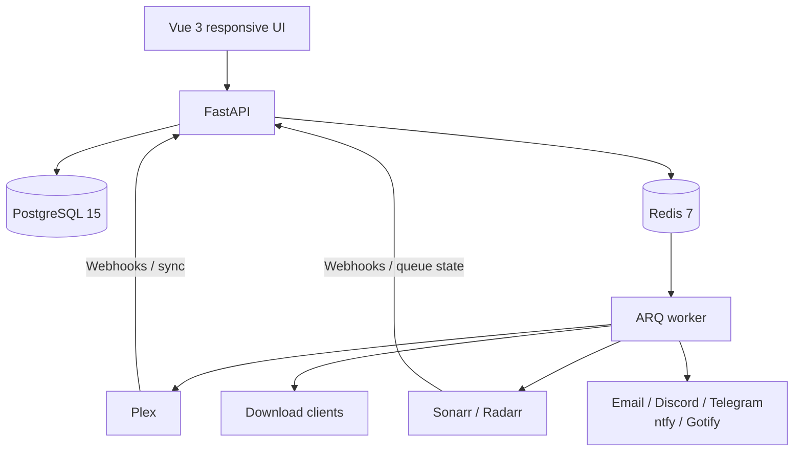

<p align="center">
  
</p>

<p align="center">
  <a href="https://github.com/remi-deher/plex-rss/actions/workflows/tests.yml"></a>
  <a href="https://github.com/remi-deher/plex-rss/actions/workflows/e2e.yml"></a>
  <a href="https://github.com/remi-deher/plex-rss/actions/workflows/docker-publish.yml"></a>
  <a href="https://hub.docker.com/r/mrcryllix/plex-rss"></a>
  <a href="LICENSE"></a>
</p>

<p align="center"><strong>🇬🇧 English</strong> · <a href="README.fr.md">🇫🇷 Français</a></p>

<p align="center">
  <strong>Plexarr turns "someone wants a movie" into "it's playing in the right language" — without you touching a spreadsheet.</strong>
</p>

> [!NOTE]
> The project used to be called *Plex RSS Monitor*. The repository and image kept the technical name `plex-rss`, but the application is now **Plexarr**.

---

## Why Plexarr

Overseerr and Jellyseerr are great at the front door: they let people request media and hand it to Sonarr/Radarr. Plexarr starts from the same front door, but stays involved for the whole trip — it watches the download, catches imports that stall, confirms the title is actually *in Plex*, and — where it earns its name — checks whether the audio track people asked for (VF/dub, VO, partial) is really there before anyone gets notified.

| | Plexarr | Typical request manager |
|---|---|---|
| Intake sources | Plex Watchlist (API + RSS), UI, API, Overseerr/Jellyseerr | UI, API |
| Post-approval tracking | Download → import → Plex availability → audio-track analysis | Sends to Sonarr/Radarr, mostly stops there |
| Stuck-import detection | Yes — flags "downloaded but never imported" after two consecutive checks | No |
| Language/dub tracking | Per season, per episode: original, dub, secondary dub, partial coverage | No |
| Notifications | Milestone-grouped (one message for a whole season, not one per episode) | Per-event, can flood |
| Deployment | Docker Compose: API + worker + PostgreSQL + Redis | Varies |

If you already run Overseerr/Jellyseerr for the request UI and just want the acquisition-to-availability tracking, Plexarr's own API/UI/watchlist intake means you can also run it standalone — Seerr integration is optional, not required.

## Screenshots

<table>
<tr>
<td width="50%"></td>
<td width="50%"></td>
</tr>
<tr>
<td>Discover — browse and request in one click.</td>
<td>Calendar — releases and availability at a glance.</td>
</tr>
</table>

> [!NOTE]
> These screenshots use seeded demo data captured against the real UI (no real Plex library or personal instance is shown).

## What it actually does

### Requests & routing
- Intake from **Plex Watchlist API**, a **Plex RSS** feed, the Plexarr API, the Discover UI, or **Overseerr/Jellyseerr**.
- Routes to multiple **Sonarr** and **Radarr** instances.
- Optional admin approval, co-requesters, and full provenance history.
- Release search via Prowlarr with direct push to a compatible download client.
- Whole series, selected seasons, or a single episode.

### Downloads & imports
- Unified queue across Sonarr/Radarr and direct clients.
- Progress, ETA, operational state, and the reason something is waiting.
- Detects a completed download that never made it through import.
- Flags issues only after two consecutive checks, to avoid false alarms on a slow scan.
- Manual matching and import from the UI when automation can't resolve it.

### Plex availability & language tracking
- Clear separation between requested → sent to *arr → downloading → imported → available in Plex.
- Syncs media already present in the library, not just new requests.
- Season- and episode-level coverage, not just "the show exists."
- Detects original audio, dub (VF), secondary dub, and partial coverage.
- Works across movies, full series, full seasons, and single episodes.

### Notifications
- Email (SMTP), Discord, Telegram, ntfy, and Gotify.
- Customizable templates with live preview and per-user simulation.
- Milestones are grouped — adding a full season doesn't mean one email per episode.
- Separate events for requested, available, dub upgraded, corrected, and failed.
- Per-media and per-user history: channel, recipient, and delivery result.
- A single kill switch to pause sending without pausing analysis.

### Responsive interface
- Collapsible sidebar on desktop/tablet, mobile nav with safe-area support.
- Dashboard and 30-day activity, broken down by requests, availability, or notifications.
- Library view with compact filters.
- Calendar in Agenda or Month view; downloads grouped by what action they need.
- Media detail pages with a timeline, cast, upcoming releases, requests, and notification history.
- Settings with an overview and search across every section.
- Operations center: maintenance, logs, and incident view.
- User management: permissions, notification preferences, and activity.

## How a request moves through the system


```mermaid
flowchart LR
    A["Plex Watchlist<br/>API / RSS"] --> D["Plexarr request"]
    B["Discover UI<br/>manual add"] --> D
    C["API / Seerr"] --> D
    D --> E{"Approval<br/>required?"}
    E -->|Yes| F["Admin review"]
    E -->|No| G["Sonarr / Radarr"]
    F --> G
    G --> H["Download client"]
    H --> I{"Import succeeded?"}
    I -->|No| J["Flagged for review"]
    J --> I
    I -->|Yes| K["Plex detects the media"]
    K --> L["VO / VF analysis<br/>& coverage"]
    L --> M["Grouped notification"]
```

The original request stays attached end to end. A Watchlist or API request for a series implies every season except season 0; a manual request can target just a few seasons, or a single episode.

## Architecture


```mermaid
flowchart TB
    UI["Vue 3 responsive UI"] --> API["FastAPI"]
    API --> PG[("PostgreSQL 15")]
    API --> REDIS[("Redis 7")]
    REDIS --> WORKER["ARQ worker"]
    WORKER --> PLEX["Plex"]
    WORKER --> ARR["Sonarr / Radarr"]
    WORKER --> CLIENTS["Download clients"]
    WORKER --> CHANNELS["Email / Discord / Telegram<br/>ntfy / Gotify"]
    PLEX -->|Webhooks / sync| API
    ARR -->|Webhooks / queue state| API
```

| Component | Role |
|---|---|
| `plex-rss` | FastAPI backend, Vue UI, webhooks, and the real-time event stream |
| `worker` | ARQ jobs: polling, VO/VF analysis, notifications, and other long-running work |
| `db` | PostgreSQL 15, the system of record |
| `redis` | ARQ queue, heartbeat, cache, and real-time signals (via Redis Streams) |
| `backup` / `restore` | PostgreSQL tooling, enabled via the Compose `operations` profile |

### The stack, precisely

| Layer | Choice | Why it's there |
|---|---|---|
| Backend | Python 3.12, FastAPI, SQLAlchemy 2 (async), Alembic | Typed async request handling; migrations are mandatory, not optional, for a system that must never silently drop a request. |
| Background work | ARQ over Redis | A dedicated worker process keeps polling/analysis/notification jobs off the request path — the API stays responsive even during a large sync. |
| Frontend | Vue 3 (Composition API), Vite, vue-router | SPA served by FastAPI's static mount; no separate frontend deployment. |
| Real time | Server-Sent Events (`/api/events`) backed by Redis Streams | SSE over a message broker keeps clients in sync without polling, and `Last-Event-ID` lets a reconnecting tab resume instead of missing signals — events carry no business payload, the client refetches through normal REST, so permissions are never bypassed. |
| Data | PostgreSQL 15 | Two core tables carry most of the domain: `media_requests` (the request lifecycle: status, fulfillment_status, arr linkage, VF granularity) and `library_items` (what's actually confirmed present in Plex, with its own VF/VO state) — reconciled at display time rather than merged, so "requested" and "present" never get confused. |
| Secrets | `cryptography.Fernet`, key in `PLEXARR_ENCRYPTION_KEY` | Plex/*arr/notification tokens are encrypted at rest; the key lives outside the database dump on purpose. |
| Integrations | `plexapi`, Sonarr/Radarr REST + webhooks, Prowlarr | Webhooks cut detection latency to near-zero; polling stays on as the fallback so a missed webhook never means a permanently stuck request. |
| Auth | Plex OAuth SSO, WebAuthn (passkeys), session cookies | No password database to leak; passkeys are optional hardening on top of Plex SSO. |
| Packaging | Multi-stage `python:3.12-alpine` Docker build | Same image runs the API and the worker — only the container command differs. |

## Installation (Docker)

### Prerequisites

- Docker Engine 24+ or a recent Docker Desktop.
- Docker Compose v2.
- A persistent location for `data/` and `backups/`.

### 1. Get the config

```bash
git clone https://github.com/remi-deher/plex-rss.git
cd plex-rss
cp .env.example .env
```

PowerShell:

```powershell
Copy-Item .env.example .env
```

### 2. Generate secrets

Set a long PostgreSQL password in `.env`, then generate the encryption key:

```bash
python -c "from cryptography.fernet import Fernet; print(Fernet.generate_key().decode())"
```

```dotenv
TZ=Europe/Paris
POSTGRES_DB=plexrss
POSTGRES_PASSWORD=replace-with-a-long-secret
PLEXARR_ENCRYPTION_KEY=paste-the-fernet-key
ARQ_MAX_JOBS=4
ARQ_JOB_TIMEOUT=3600
BACKUP_RETENTION_DAYS=14
```

> [!CAUTION]
> Keep `PLEXARR_ENCRYPTION_KEY` safe. Losing it makes already-stored secrets undecryptable. Never publish your `.env` file.

### 3. Start

The repo's Compose file builds the image locally:

```bash
docker compose up -d --build
docker compose ps
```

The app is then available at [http://localhost:8000](http://localhost:8000).

To run only the published image, swap `build: .` for:

```yaml
image: mrcryllix/plex-rss:latest
```

in both the `plex-rss` and `worker` services.

> [!TIP]
> `latest` tracks `main` and moves on every merge — convenient for a personal instance, riskier in production since a regression ships on the next `docker compose pull`. For a stable deployment, pin a tagged version (`vX.Y.Z`, built from a Git tag) and only bump it after reading the [changelog](CHANGELOG.md). Images are published to both Docker Hub (`mrcryllix/plex-rss`) and GitHub Container Registry (`ghcr.io/remi-deher/plex-rss`); only `linux/amd64` is built for now.

### Minimal complete deployment

```yaml
services:
  plex-rss:
    image: mrcryllix/plex-rss:latest
    ports: ["8000:8000"]
    volumes: ["./data:/app/data"]
    env_file: [.env]
    environment:
      DATABASE_URL: postgresql://plexrss:${POSTGRES_PASSWORD}@db:5432/${POSTGRES_DB:-plexrss}
      REDIS_URL: redis://redis:6379/0
      ENABLE_ARQ: "1"
      ENABLE_LEGACY_SCHEDULER: "0"
    depends_on:
      db: { condition: service_healthy }
      redis: { condition: service_healthy }
    restart: unless-stopped

  worker:
    image: mrcryllix/plex-rss:latest
    command: ["arq", "app.jobs.WorkerSettings"]
    volumes: ["./data:/app/data"]
    env_file: [.env]
    environment:
      DATABASE_URL: postgresql://plexrss:${POSTGRES_PASSWORD}@db:5432/${POSTGRES_DB:-plexrss}
      REDIS_URL: redis://redis:6379/0
      ENABLE_ARQ: "1"
    depends_on:
      plex-rss: { condition: service_healthy }
    restart: unless-stopped

  db:
    image: postgres:15-alpine
    environment:
      POSTGRES_USER: plexrss
      POSTGRES_PASSWORD: ${POSTGRES_PASSWORD}
      POSTGRES_DB: ${POSTGRES_DB:-plexrss}
    volumes: ["pgdata:/var/lib/postgresql/data"]
    healthcheck:
      test: ["CMD-SHELL", "pg_isready -U plexrss -d ${POSTGRES_DB:-plexrss}"]
      interval: 10s
      timeout: 5s
      retries: 5
    restart: unless-stopped

  redis:
    image: redis:7-alpine
    command: redis-server --appendonly yes
    volumes: ["redisdata:/data"]
    healthcheck:
      test: ["CMD", "redis-cli", "ping"]
      interval: 10s
      timeout: 5s
      retries: 5
    restart: unless-stopped

volumes:
  pgdata:
  redisdata:
```

## First run

1. Open the app and create the owner account.
2. In **Settings → Overview**, check for incomplete sections.
3. Configure Plex, then Sonarr/Radarr and their root folders.
4. Sync Plex users.
5. Set up at least one notification channel.
6. Run the connection tests from the UI.
7. Add webhooks to cut detection latency.

## Configuring integrations

### Webhooks

Use a Plexarr URL reachable from the containers/servers that send them:

| Source | URL | Useful events |
|---|---|---|
| Sonarr | `https://plexarr.example.com/webhook/sonarr` | Download / Import / Upgrade |
| Radarr | `https://plexarr.example.com/webhook/radarr` | Download / Import / Upgrade |
| Plex | `https://plexarr.example.com/webhook/plex` | `library.new`, media events |

Polling stays active as a catch-all. The Plex webhook requires a Plex Pass subscription.

### Reverse proxy

The proxy must forward `Host`, `X-Forwarded-For`, and `X-Forwarded-Proto`, allow webhooks through, and must not cache `/api/events`, which uses SSE.

### Storage & permissions

- `pgdata` holds the PostgreSQL database.
- `redisdata` keeps Redis in AOF mode.
- `./data` holds the session key and any legacy SQLite migration data.
- `./backups` receives PostgreSQL dumps.

## Operations

### Quick checks

```bash
docker compose ps
docker compose logs --tail=100 plex-rss
docker compose logs --tail=100 worker
docker compose exec worker arq --check app.jobs.WorkerSettings
docker compose exec redis redis-cli ping
docker compose exec db pg_isready -U plexrss -d plexrss
```

| Endpoint | Use |
|---|---|
| `/api/health` | Health of Plex, *arr instances, and infrastructure |
| `/api/metrics/prometheus` | Prometheus metrics: Redis, worker, and queues |
| `/api/events` | Authenticated SSE stream for real-time UI refresh |

In the UI, check **Operations → Overview** before diving into logs — stuck imports, conflicts, and recommended actions are already grouped there.

### Expected state

```text
plex-rss   healthy
worker     healthy
db         healthy
redis      healthy
```

If the worker is down, the UI can stay reachable, but polling, analysis, and deferred notifications stop making progress.

## Troubleshooting

### `plex-rss` stays "unhealthy", the worker never starts

The worker depends on `plex-rss: { condition: service_healthy }` — while the API isn't healthy, it won't even attempt to start. Always check the API logs first:

```bash
docker compose logs --tail=200 plex-rss
```

The most common cause is a failed Alembic migration on startup (migrations run before the API starts listening).

### Migration fails with `DuplicateTable` / "already exists" on every retry

Sign that a previous migration attempt was interrupted (concurrent restart, hard stop) after partially applying a schema change, without `alembic_version` advancing — so every restart replays the same migration and fails the same way, since the object already exists.

1. Identify the duplicate object in the error message (index, column, constraint...).
2. Connect to PostgreSQL and check the real state:
   ```bash
   docker compose exec db psql -U plexrss -d plexrss -c "\d table_name"
   docker compose exec db psql -U plexrss -d plexrss -c "SELECT version_num FROM alembic_version;"
   ```
3. If the object from the error already exists but `alembic_version` hasn't advanced to the revision that creates it, drop only that duplicate object (`DROP INDEX ...`, never `DROP TABLE`) so the migration can recreate it cleanly on the next start.
4. Restart with `docker compose up -d plex-rss`: the container's retry loop should then pass the migration and go back to "healthy".

Migrations added since July 2026 use `CREATE INDEX IF NOT EXISTS` / `DROP INDEX IF EXISTS` to stay replayable without manual intervention — this scenario shouldn't recur for future index migrations.

### Worker is "healthy" but nothing processes

Confirm `ENABLE_ARQ=1` is set on both services and that Redis responds (`docker compose exec redis redis-cli ping`). A worker that can't reach Redis at startup can still report healthy on its own healthcheck while consuming no jobs.

## Backup & restore

Create and verify a dump:

```bash
docker compose --profile operations run --rm backup
```

Restoring requires stopping the services that write:

```bash
docker compose stop plex-rss worker
RESTORE_FILE=plexarr-YYYYMMDDTHHMMSSZ.dump CONFIRM_RESTORE=YES \
  docker compose --profile operations run --rm restore
docker compose up -d plex-rss worker
```

Test a restore regularly. A backup file that has never been restored isn't a verified backup.

## Updating

### Published image

```bash
docker compose --profile operations run --rm backup
docker compose pull
docker compose up -d
docker compose ps
```

### Local build

```bash
git pull --ff-only
docker compose --profile operations run --rm backup
docker compose up -d --build
```

Alembic migrations run when the API starts. Check the logs before considering the update done.

### Migrating from an old SQLite database

The Compose file keeps `AUTO_MIGRATE_LEGACY_SQLITE=1` and `LEGACY_SQLITE_PATH=/app/data/plex_rss.db`. The import only runs if PostgreSQL is empty. Keep a copy of the SQLite file before the first start and read the [migration guide](docs/LEGACY_DATABASE_MIGRATION.md).

## Development

### Backend

```bash
python -m venv .venv
# Linux/macOS: source .venv/bin/activate
# PowerShell:  .venv\Scripts\Activate.ps1
pip install -r requirements.txt -r requirements-dev.txt
alembic upgrade head
uvicorn app.main:app --reload
```

### Frontend

```bash
npm ci
npm run dev
npm run build
npm run test:e2e
```

### Tests & quality

```bash
python -m pytest -q -p no:xonsh -p no:xonsh.pytest.plugin
python -m ruff check .
```

Contribution guidelines live in [CONTRIBUTING.md](CONTRIBUTING.md). For deeper operational detail, see [docs/OPERATIONS.md](docs/OPERATIONS.md).

## Security

- Never publish `.env`, Plex/*arr tokens, or notification keys.
- Put Plexarr behind HTTPS for any remote access.
- Don't expose PostgreSQL or Redis directly — no host port is required for either.
- Back up `PLEXARR_ENCRYPTION_KEY` separately from PostgreSQL dumps.
- Review Dependabot, CodeQL, and Trivy alerts before a major update.
- GDPR: a processing-activity register template is provided in [docs/RGPD_REGISTRE.md](docs/RGPD_REGISTRE.md). Fill in the data controller's contact in **Settings → GDPR** (it feeds the public `/privacy` page).

## License

[MIT](LICENSE) — Copyright © 2026 Rémi DEHER.
