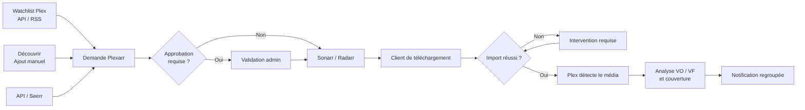
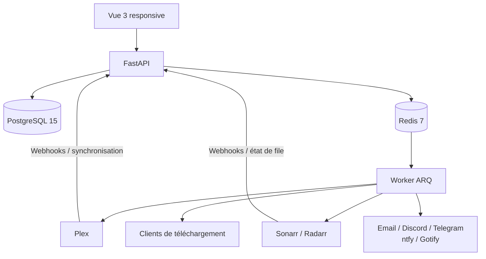
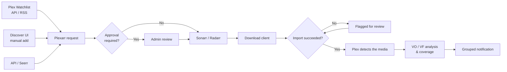
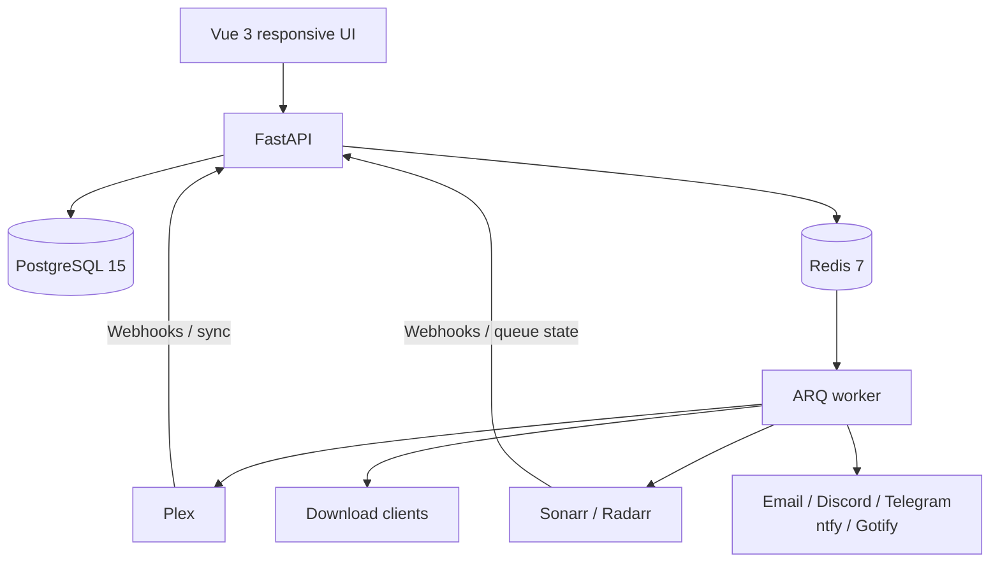

<p align="center">
  
</p>

<p align="center">
  <a href="https://github.com/remi-deher/plex-rss/actions/workflows/tests.yml"></a>
  <a href="https://github.com/remi-deher/plex-rss/actions/workflows/e2e.yml"></a>
  <a href="https://github.com/remi-deher/plex-rss/actions/workflows/docker-publish.yml"></a>
  <a href="https://hub.docker.com/r/mrcryllix/plex-rss"></a>
  <a href="LICENSE"></a>
</p>

<p align="center"><a href="#français">🇫🇷 Français</a> · <a href="#english">🇬🇧 English</a></p>

> [!NOTE]
> Le projet s'appelait auparavant *Plex RSS Monitor* / This project used to be called *Plex RSS Monitor*. Le dépôt et l'image conservent le nom technique `plex-rss` / The repository and image kept the technical name `plex-rss`, mais l'application s'appelle désormais **Plexarr** / but the application is now **Plexarr**.

---

## Français

<p align="center">
  <strong>Plexarr repère en un coup d'œil les films et épisodes de ta bibliothèque encore en VO, pour savoir immédiatement quoi prioriser vers la VF.</strong>
</p>

### Pourquoi Plexarr

Overseerr et Jellyseerr sont excellents à l'entrée : ils laissent les gens demander un média et le transmettent à Sonarr/Radarr. Plexarr part de la même porte d'entrée, mais reste impliqué sur tout le trajet — il surveille le téléchargement, détecte les imports bloqués, confirme que le titre est *réellement* dans Plex, et — là où il gagne son nom — vérifie que la piste audio demandée (VF, VO, partielle) est vraiment présente avant de notifier qui que ce soit.

| | Plexarr | Gestionnaire de demandes classique |
|---|---|---|
| Sources de demandes | Watchlist Plex (API + RSS), interface, API, Overseerr/Jellyseerr | Interface, API |
| Watchlists des amis | Flux RSS Universal Watchlist (Plex Pass) — agrège les watchlists de tous tes amis sans qu'ils aient besoin de se connecter à Plexarr | Chaque utilisateur doit se connecter au moins une fois pour lier sa watchlist |
| Suivi après approbation | Téléchargement → import → disponibilité Plex → analyse des pistes audio | Envoie à Sonarr/Radarr, s'arrête généralement là |
| Détection d'import bloqué | Oui — signale « téléchargé mais jamais importé » après deux contrôles consécutifs | Non |
| Suivi de langue/doublage | Par saison, par épisode : VO, VF, VF secondaire, couverture partielle | Non |
| Notifications | Regroupées par jalon (un message pour toute une saison, pas un par épisode) | Par événement, peut inonder |
| Déploiement | Docker Compose : API + worker + PostgreSQL + Redis | Variable |

Si tu utilises déjà Overseerr/Jellyseerr pour l'interface de demande et que tu veux juste le suivi acquisition → disponibilité, l'entrée propre de Plexarr (API/interface/watchlist) permet aussi de l'utiliser seul — l'intégration Seerr est optionnelle, pas obligatoire.

L'agrégation par flux RSS mérite une précision : c'est une fonctionnalité **Plex Pass** (Universal Watchlist), configurée une seule fois par l'admin via l'URL RSS de son compte Plex. Elle expose ensuite les watchlists de tous ses amis Plex sans qu'aucun d'eux n'ait à se connecter à Plexarr ni à générer de token — contrairement à Overseerr/Jellyseerr, où chaque utilisateur doit s'authentifier au moins une fois pour que son compte soit reconnu.

### Captures d'écran

<table>
<tr>
<td width="50%"></td>
<td width="50%"></td>
</tr>
<tr>
<td>Découvrir — parcourir et demander en un clic.</td>
<td>Calendrier — sorties et disponibilités en un coup d'œil.</td>
</tr>
</table>

> [!NOTE]
> Ces captures utilisent des données de démonstration générées pour l'occasion, capturées sur la vraie interface (aucune bibliothèque Plex ni instance personnelle réelle n'est montrée).

### Ce que fait Plexarr

#### Demandes et orchestration
- Entrées depuis la **Watchlist Plex API**, un flux **RSS Plex**, l'API Plexarr, l'interface Découvrir ou **Overseerr/Jellyseerr**.
- Flux RSS **Universal Watchlist** (Plex Pass) : surveille les watchlists de tous tes amis Plex d'un coup, sans qu'ils aient besoin de se connecter à Plexarr.
- Routage direct vers plusieurs instances **Sonarr** et **Radarr**.
- Approbation facultative, co-demandeurs et historique de la provenance.
- Recherche de releases via Prowlarr et ajout direct à un client compatible.
- Prise en charge des séries complètes, de quelques saisons ou d'un épisode unique.

#### Téléchargements et imports
- File unifiée Sonarr/Radarr et clients directs.
- Progression, temps restant, état opérationnel et raison d'attente.
- Détection d'un téléchargement terminé mais bloqué à l'import.
- Confirmation après deux contrôles consécutifs pour limiter les faux blocages.
- Association et import manuels depuis l'interface.

#### Disponibilité Plex et langues
- Bibliothèque filtrable par statut VF/VO en un clic, pour repérer immédiatement ce qui reste à mettre à jour vers la VF.
- Séparation claire entre demande, transmission \*arr, téléchargement, import et disponibilité Plex.
- Synchronisation des médias déjà présents dans Plex, pas seulement des nouvelles demandes.
- Couverture par saison et épisode, pas juste « la série existe ».
- Analyse VO, VF, VF secondaire et disponibilité partielle.
- Gestion des films, séries complètes, saisons complètes et épisodes isolés.

#### Notifications
- Email SMTP, Discord, Telegram, ntfy et Gotify.
- Modèles personnalisables avec aperçu et simulation par utilisateur.
- Jalons regroupés pour éviter un email par épisode lors de l'ajout d'une série complète.
- Événements séparés pour demande, disponibilité, amélioration VF, correction et échec.
- Historique par média et par utilisateur, avec canal, destinataire et résultat.
- Bascule globale permettant de bloquer les envois sans interrompre l'analyse.

#### Interface responsive
- Sidebar repliable sur ordinateur et tablette, navigation mobile avec safe areas.
- Dashboard et activité sur 30 jours par demandes, disponibilités ou notifications.
- Bibliothèque avec filtres compacts.
- Calendrier Agenda/Mois et téléchargements regroupés par action requise.
- Fiches média avec timeline, couverture, prochaines sorties, demandes et notifications.
- Paramètres avec vue d'ensemble et recherche.
- Centre d'exploitation, maintenance, journaux et incidents.
- Gestion des utilisateurs, permissions, notifications et activité.

### Le parcours d'une demande


```mermaid
flowchart LR
    A["Watchlist Plex<br/>API / RSS"] --> D["Demande Plexarr"]
    B["Découvrir<br/>Ajout manuel"] --> D
    C["API / Seerr"] --> D
    D --> E{"Approbation<br/>requise ?"}
    E -->|Oui| F["Validation admin"]
    E -->|Non| G["Sonarr / Radarr"]
    F --> G
    G --> H["Client de téléchargement"]
    H --> I{"Import réussi ?"}
    I -->|Non| J["Intervention requise"]
    J --> I
    I -->|Oui| K["Plex détecte le média"]
    K --> L["Analyse VO / VF<br/>et couverture"]
    L --> M["Notification regroupée"]
```

Le point d'entrée est conservé pendant tout le parcours. Une demande API ou Watchlist portant sur une série implique toutes les saisons hors saison 0, tandis qu'une demande manuelle peut cibler seulement certaines saisons ou un épisode.

### Architecture


```mermaid
flowchart TB
    UI["Vue 3 responsive"] --> API["FastAPI"]
    API --> PG[("PostgreSQL 15")]
    API --> REDIS[("Redis 7")]
    REDIS --> WORKER["Worker ARQ"]
    WORKER --> PLEX["Plex"]
    WORKER --> ARR["Sonarr / Radarr"]
    WORKER --> CLIENTS["Clients de téléchargement"]
    WORKER --> CHANNELS["Email / Discord / Telegram<br/>ntfy / Gotify"]
    PLEX -->|Webhooks / synchronisation| API
    ARR -->|Webhooks / état de file| API
```

| Composant | Rôle |
|---|---|
| `plex-rss` | API FastAPI, interface Vue, webhooks et flux d'événements temps réel |
| `worker` | Jobs ARQ, polling, analyse, notifications et traitements longs |
| `db` | PostgreSQL 15, source de vérité |
| `redis` | File ARQ, heartbeat, cache et signaux temps réel (via Redis Streams) |
| `backup` / `restore` | Outils PostgreSQL activés par le profil Compose `operations` |

#### La stack, précisément

| Couche | Choix | Pourquoi |
|---|---|---|
| Backend | Python 3.12, FastAPI, SQLAlchemy 2 (async), Alembic | Gestion async typée des requêtes ; les migrations sont obligatoires, pas optionnelles, pour un système qui ne doit jamais perdre une demande silencieusement. |
| Traitement asynchrone | ARQ sur Redis | Un worker dédié sort le polling/l'analyse/les notifications du chemin de requête — l'API reste réactive même pendant une grosse synchronisation. |
| Frontend | Vue 3 (Composition API), Vite, vue-router | SPA servie par le montage statique de FastAPI ; pas de déploiement frontend séparé. |
| Temps réel | Server-Sent Events (`/api/events`) adossé à Redis Streams | SSE + broker de messages garde les clients synchronisés sans polling, et `Last-Event-ID` permet à un onglet qui se reconnecte de reprendre au lieu de rater des signaux — les événements ne portent aucune donnée métier, le client recharge via le REST classique, donc les permissions ne sont jamais contournées. |
| Données | PostgreSQL 15 | Deux tables centrales portent l'essentiel du domaine : `media_requests` (cycle de vie de la demande : statut, fulfillment_status, rattachement \*arr, granularité VF) et `library_items` (ce qui est réellement confirmé présent dans Plex, avec son propre état VF/VO) — rapprochées à l'affichage plutôt que fusionnées, pour ne jamais confondre « demandé » et « présent ». |
| Secrets | `cryptography.Fernet`, clé dans `PLEXARR_ENCRYPTION_KEY` | Les tokens Plex/\*arr/notifications sont chiffrés au repos ; la clé vit volontairement en dehors du dump de la base. |
| Intégrations | `plexapi`, REST + webhooks Sonarr/Radarr, Prowlarr | Les webhooks réduisent la latence de détection à presque zéro ; le polling reste actif en filet de sécurité pour qu'un webhook manqué ne bloque jamais une demande définitivement. |
| Authentification | SSO OAuth Plex, WebAuthn (passkeys), cookies de session | Aucune base de mots de passe à fuiter ; les passkeys sont un durcissement optionnel par-dessus le SSO Plex. |
| Packaging | Build Docker multi-étapes `python:3.12-alpine` | La même image fait tourner l'API et le worker — seule la commande du conteneur change. |

### Installation Docker

#### Prérequis

- Docker Engine 24+ ou Docker Desktop récent.
- Docker Compose v2.
- Un répertoire persistant pour `data/` et `backups/`.

#### 1. Récupérer la configuration

```bash
git clone https://github.com/remi-deher/plex-rss.git
cd plex-rss
cp .env.example .env
```

Sous PowerShell :

```powershell
Copy-Item .env.example .env
```

#### 2. Générer les secrets

Définissez dans `.env` un mot de passe PostgreSQL long, puis générez la clé de chiffrement :

```bash
python -c "from cryptography.fernet import Fernet; print(Fernet.generate_key().decode())"
```

```dotenv
TZ=Europe/Paris
POSTGRES_DB=plexrss
POSTGRES_PASSWORD=remplacer-par-un-secret-long
PLEXARR_ENCRYPTION_KEY=coller-la-cle-fernet
ARQ_MAX_JOBS=4
ARQ_JOB_TIMEOUT=3600
BACKUP_RETENTION_DAYS=14
```

> [!CAUTION]
> Conservez `PLEXARR_ENCRYPTION_KEY`. La perdre empêche de déchiffrer les secrets déjà enregistrés. Ne publiez jamais votre fichier `.env`.

#### 3. Démarrer

Le fichier du dépôt construit l'image locale :

```bash
docker compose up -d --build
docker compose ps
```

L'application est ensuite disponible sur [http://localhost:8000](http://localhost:8000).

Pour utiliser uniquement l'image publiée, remplacez `build: .` par :

```yaml
image: mrcryllix/plex-rss:latest
```

dans les services `plex-rss` et `worker`.

> [!TIP]
> `latest` suit `main` et change à chaque merge : pratique pour un usage personnel, plus risqué en production car une régression est livrée dès le prochain `docker compose pull`. Pour un déploiement stable, préférez épingler une version taguée (`vX.Y.Z`, construite depuis un tag Git) et ne montez de version qu'après avoir lu le [changelog](CHANGELOG.md). Les images sont publiées à la fois sur Docker Hub (`mrcryllix/plex-rss`) et GitHub Container Registry (`ghcr.io/remi-deher/plex-rss`), seule l'architecture `linux/amd64` est construite pour le moment.

#### Déploiement minimal complet

```yaml
services:
  plex-rss:
    image: mrcryllix/plex-rss:latest
    ports: ["8000:8000"]
    volumes: ["./data:/app/data"]
    env_file: [.env]
    environment:
      DATABASE_URL: postgresql://plexrss:${POSTGRES_PASSWORD}@db:5432/${POSTGRES_DB:-plexrss}
      REDIS_URL: redis://redis:6379/0
      ENABLE_ARQ: "1"
      ENABLE_LEGACY_SCHEDULER: "0"
    depends_on:
      db: { condition: service_healthy }
      redis: { condition: service_healthy }
    restart: unless-stopped

  worker:
    image: mrcryllix/plex-rss:latest
    command: ["arq", "app.jobs.WorkerSettings"]
    volumes: ["./data:/app/data"]
    env_file: [.env]
    environment:
      DATABASE_URL: postgresql://plexrss:${POSTGRES_PASSWORD}@db:5432/${POSTGRES_DB:-plexrss}
      REDIS_URL: redis://redis:6379/0
      ENABLE_ARQ: "1"
    depends_on:
      plex-rss: { condition: service_healthy }
    restart: unless-stopped

  db:
    image: postgres:15-alpine
    environment:
      POSTGRES_USER: plexrss
      POSTGRES_PASSWORD: ${POSTGRES_PASSWORD}
      POSTGRES_DB: ${POSTGRES_DB:-plexrss}
    volumes: ["pgdata:/var/lib/postgresql/data"]
    healthcheck:
      test: ["CMD-SHELL", "pg_isready -U plexrss -d ${POSTGRES_DB:-plexrss}"]
      interval: 10s
      timeout: 5s
      retries: 5
    restart: unless-stopped

  redis:
    image: redis:7-alpine
    command: redis-server --appendonly yes
    volumes: ["redisdata:/data"]
    healthcheck:
      test: ["CMD", "redis-cli", "ping"]
      interval: 10s
      timeout: 5s
      retries: 5
    restart: unless-stopped

volumes:
  pgdata:
  redisdata:
```

### Premier démarrage

1. Ouvrez l'application et créez le compte propriétaire.
2. Dans **Paramètres → Vue d'ensemble**, vérifiez les sections incomplètes.
3. Configurez Plex, puis Sonarr/Radarr et leurs dossiers racines.
4. Synchronisez les utilisateurs Plex.
5. Configurez au moins un canal de notification.
6. Lancez les tests de connexion depuis l'interface.
7. Ajoutez les webhooks pour réduire le délai de détection.

### Configuration des intégrations

#### Webhooks

Utilisez une URL Plexarr accessible depuis les conteneurs ou serveurs sources :

| Source | URL | Événements utiles |
|---|---|---|
| Sonarr | `https://plexarr.example.com/webhook/sonarr` | Download / Import / Upgrade |
| Radarr | `https://plexarr.example.com/webhook/radarr` | Download / Import / Upgrade |
| Plex | `https://plexarr.example.com/webhook/plex` | `library.new`, événements média |

Le polling reste actif comme mécanisme de rattrapage. Le webhook Plex nécessite un abonnement Plex Pass.

#### Reverse proxy

Le proxy doit transmettre `Host`, `X-Forwarded-For` et `X-Forwarded-Proto`, autoriser les webhooks et ne pas mettre en cache `/api/events`, qui utilise SSE.

#### Stockage et permissions

- `pgdata` contient la base PostgreSQL.
- `redisdata` conserve Redis en mode AOF.
- `./data` conserve la clé de session et les éventuelles données de migration SQLite.
- `./backups` reçoit les dumps PostgreSQL.

### Exploitation

#### Vérifications rapides

```bash
docker compose ps
docker compose logs --tail=100 plex-rss
docker compose logs --tail=100 worker
docker compose exec worker arq --check app.jobs.WorkerSettings
docker compose exec redis redis-cli ping
docker compose exec db pg_isready -U plexrss -d plexrss
```

| Endpoint | Usage |
|---|---|
| `/api/health` | Santé de Plex, des instances \*arr et de l'infrastructure |
| `/api/metrics/prometheus` | Métriques Prometheus, Redis, worker et files |
| `/api/events` | Flux SSE authentifié pour le rafraîchissement temps réel |

Dans l'interface, consultez **Exploitation → Vue d'ensemble** avant les logs : les imports bloqués, conflits et actions recommandées y sont regroupés.

#### États attendus

```text
plex-rss   healthy
worker     healthy
db         healthy
redis      healthy
```

Si le worker est indisponible, l'interface peut rester accessible mais le polling, les analyses et les notifications différées ne progresseront plus.

### Dépannage

#### `plex-rss` reste "unhealthy", le worker ne démarre jamais

Le worker dépend de `plex-rss: { condition: service_healthy }` : tant que l'API n'est pas saine, il ne tente même pas de démarrer. Commencez toujours par les logs de l'API :

```bash
docker compose logs --tail=200 plex-rss
```

La cause la plus fréquente est une migration Alembic qui échoue au démarrage (les migrations s'appliquent avant que l'API n'écoute).

#### La migration échoue avec `DuplicateTable` / "already exists" à chaque nouvelle tentative

Signe qu'une tentative de migration précédente a été interrompue (redémarrage concurrent, arrêt brutal) après avoir partiellement appliqué un changement de schéma, mais sans que `alembic_version` n'ait avancé — chaque redémarrage rejoue donc la même migration et échoue de la même façon puisque l'objet existe déjà.

1. Identifiez l'objet en doublon dans le message d'erreur (index, colonne, contrainte…).
2. Connectez-vous à PostgreSQL et vérifiez l'état réel :
   ```bash
   docker compose exec db psql -U plexrss -d plexrss -c "\d nom_de_la_table"
   docker compose exec db psql -U plexrss -d plexrss -c "SELECT version_num FROM alembic_version;"
   ```
3. Si l'objet listé dans l'erreur existe déjà mais que `alembic_version` n'a pas avancé jusqu'à la révision qui le crée, supprimez uniquement cet objet en doublon (`DROP INDEX ...`, jamais `DROP TABLE`) pour laisser la migration le recréer proprement au prochain démarrage.
4. Relancez `docker compose up -d plex-rss` : la boucle de retry du conteneur doit alors passer la migration et repasser "healthy".

Les migrations ajoutées depuis juillet 2026 utilisent `CREATE INDEX IF NOT EXISTS` / `DROP INDEX IF EXISTS` pour rester rejouables sans intervention manuelle ; ce scénario ne devrait plus se reproduire pour les futures migrations d'index.

#### Le worker est "healthy" mais rien ne se traite

Vérifiez que `ENABLE_ARQ=1` est bien défini sur les deux services et que Redis répond (`docker compose exec redis redis-cli ping`). Un worker qui ne peut pas joindre Redis au démarrage peut rester marqué sain par son propre healthcheck tout en ne consommant aucune tâche.

### Sauvegarde et restauration

Créer et vérifier un dump :

```bash
docker compose --profile operations run --rm backup
```

Restaurer un dump nécessite d'arrêter les services qui écrivent :

```bash
docker compose stop plex-rss worker
RESTORE_FILE=plexarr-YYYYMMDDTHHMMSSZ.dump CONFIRM_RESTORE=YES \
  docker compose --profile operations run --rm restore
docker compose up -d plex-rss worker
```

Testez régulièrement une restauration. Un fichier de sauvegarde qui n'a jamais été restauré ne constitue pas une sauvegarde vérifiée.

### Mise à jour

#### Image publiée

```bash
docker compose --profile operations run --rm backup
docker compose pull
docker compose up -d
docker compose ps
```

#### Construction locale

```bash
git pull --ff-only
docker compose --profile operations run --rm backup
docker compose up -d --build
```

Les migrations Alembic sont appliquées au démarrage de l'API. Consultez les logs avant de considérer la mise à jour terminée.

#### Migration d'une ancienne base SQLite

Le compose conserve `AUTO_MIGRATE_LEGACY_SQLITE=1` et `LEGACY_SQLITE_PATH=/app/data/plex_rss.db`. L'import n'a lieu que si PostgreSQL est vide. Conservez une copie du fichier SQLite avant le premier démarrage et consultez [la documentation de migration](docs/LEGACY_DATABASE_MIGRATION.md).

### Développement

#### Backend

```bash
python -m venv .venv
# Linux/macOS : source .venv/bin/activate
# PowerShell   : .venv\Scripts\Activate.ps1
pip install -r requirements.txt -r requirements-dev.txt
alembic upgrade head
uvicorn app.main:app --reload
```

#### Frontend

```bash
npm ci
npm run dev
npm run build
npm run test:e2e
```

#### Tests et qualité

```bash
python -m pytest -q -p no:xonsh -p no:xonsh.pytest.plugin
python -m ruff check .
```

Les contributions sont décrites dans [CONTRIBUTING.md](CONTRIBUTING.md). Pour l'exploitation détaillée, consultez [docs/OPERATIONS.md](docs/OPERATIONS.md).

### Sécurité

- Ne publiez jamais `.env`, les tokens Plex/\*arr ou les clés de notification.
- Placez Plexarr derrière HTTPS pour un accès distant.
- Limitez l'exposition directe de PostgreSQL et Redis : aucun port hôte n'est nécessaire.
- Sauvegardez `PLEXARR_ENCRYPTION_KEY` séparément des dumps PostgreSQL.
- Consultez les alertes Dependabot, CodeQL et Trivy avant une mise à jour majeure.
- Conformité RGPD : un modèle de registre des traitements est fourni dans [docs/RGPD_REGISTRE.md](docs/RGPD_REGISTRE.md). Renseignez le contact du responsable de traitement dans **Réglages → RGPD** (il alimente la page publique `/privacy`).

### Licence

[MIT](LICENSE) — Copyright © 2026 Rémi DEHER.

---

## English

<p align="center">
  <strong>Plexarr surfaces, at a glance, exactly which movies and episodes in your library are still in their original language — so you know what to prioritize for a French dub (VF).</strong>
</p>

### Why Plexarr

Overseerr and Jellyseerr are great at the front door: they let people request media and hand it to Sonarr/Radarr. Plexarr starts from the same front door, but stays involved for the whole trip — it watches the download, catches imports that stall, confirms the title is actually *in Plex*, and — where it earns its name — checks whether the audio track people asked for (VF/dub, VO, partial) is really there before anyone gets notified.

| | Plexarr | Typical request manager |
|---|---|---|
| Intake sources | Plex Watchlist (API + RSS), UI, API, Overseerr/Jellyseerr | UI, API |
| Friends' watchlists | Universal Watchlist RSS feed (Plex Pass) — aggregates every friend's watchlist without any of them ever signing into Plexarr | Each user has to sign in at least once to link their watchlist |
| Post-approval tracking | Download → import → Plex availability → audio-track analysis | Sends to Sonarr/Radarr, mostly stops there |
| Stuck-import detection | Yes — flags "downloaded but never imported" after two consecutive checks | No |
| Language/dub tracking | Per season, per episode: original, dub, secondary dub, partial coverage | No |
| Notifications | Milestone-grouped (one message for a whole season, not one per episode) | Per-event, can flood |
| Deployment | Docker Compose: API + worker + PostgreSQL + Redis | Varies |

If you already run Overseerr/Jellyseerr for the request UI and just want the acquisition-to-availability tracking, Plexarr's own API/UI/watchlist intake means you can also run it standalone — Seerr integration is optional, not required.

The RSS aggregation deserves a callout: it's a **Plex Pass** feature (Universal Watchlist), set up once by the admin via their Plex account's RSS URL. It then exposes every Plex friend's watchlist without any of them signing into Plexarr or generating a token — unlike Overseerr/Jellyseerr, where each user has to authenticate at least once before their account is recognized.

### Screenshots

<table>
<tr>
<td width="50%"></td>
<td width="50%"></td>
</tr>
<tr>
<td>Discover — browse and request in one click.</td>
<td>Calendar — releases and availability at a glance.</td>
</tr>
</table>

> [!NOTE]
> These screenshots use seeded demo data captured against the real UI (no real Plex library or personal instance is shown).

### What it actually does

#### Requests & routing
- Intake from **Plex Watchlist API**, a **Plex RSS** feed, the Plexarr API, the Discover UI, or **Overseerr/Jellyseerr**.
- **Universal Watchlist** RSS feed (Plex Pass): watches every Plex friend's watchlist at once, with no sign-in required from any of them.
- Routes to multiple **Sonarr** and **Radarr** instances.
- Optional admin approval, co-requesters, and full provenance history.
- Release search via Prowlarr with direct push to a compatible download client.
- Whole series, selected seasons, or a single episode.

#### Downloads & imports
- Unified queue across Sonarr/Radarr and direct clients.
- Progress, ETA, operational state, and the reason something is waiting.
- Detects a completed download that never made it through import.
- Flags issues only after two consecutive checks, to avoid false alarms on a slow scan.
- Manual matching and import from the UI when automation can't resolve it.

#### Plex availability & language tracking
- Library filterable by VF/VO status in one click, to immediately spot what still needs a French dub.
- Clear separation between requested → sent to *arr → downloading → imported → available in Plex.
- Syncs media already present in the library, not just new requests.
- Season- and episode-level coverage, not just "the show exists."
- Detects original audio, dub (VF), secondary dub, and partial coverage.
- Works across movies, full series, full seasons, and single episodes.

#### Notifications
- Email (SMTP), Discord, Telegram, ntfy, and Gotify.
- Customizable templates with live preview and per-user simulation.
- Milestones are grouped — adding a full season doesn't mean one email per episode.
- Separate events for requested, available, dub upgraded, corrected, and failed.
- Per-media and per-user history: channel, recipient, and delivery result.
- A single kill switch to pause sending without pausing analysis.

#### Responsive interface
- Collapsible sidebar on desktop/tablet, mobile nav with safe-area support.
- Dashboard and 30-day activity, broken down by requests, availability, or notifications.
- Library view with compact filters.
- Calendar in Agenda or Month view; downloads grouped by what action they need.
- Media detail pages with a timeline, cast, upcoming releases, requests, and notification history.
- Settings with an overview and search across every section.
- Operations center: maintenance, logs, and incident view.
- User management: permissions, notification preferences, and activity.

### How a request moves through the system


```mermaid
flowchart LR
    eA["Plex Watchlist<br/>API / RSS"] --> eD["Plexarr request"]
    eB["Discover UI<br/>manual add"] --> eD
    eC["API / Seerr"] --> eD
    eD --> eE{"Approval<br/>required?"}
    eE -->|Yes| eF["Admin review"]
    eE -->|No| eG["Sonarr / Radarr"]
    eF --> eG
    eG --> eH["Download client"]
    eH --> eI{"Import succeeded?"}
    eI -->|No| eJ["Flagged for review"]
    eJ --> eI
    eI -->|Yes| eK["Plex detects the media"]
    eK --> eL["VO / VF analysis<br/>& coverage"]
    eL --> eM["Grouped notification"]
```

The original request stays attached end to end. A Watchlist or API request for a series implies every season except season 0; a manual request can target just a few seasons, or a single episode.

### Architecture


```mermaid
flowchart TB
    eUI["Vue 3 responsive UI"] --> eAPI["FastAPI"]
    eAPI --> ePG[("PostgreSQL 15")]
    eAPI --> eREDIS[("Redis 7")]
    eREDIS --> eWORKER["ARQ worker"]
    eWORKER --> ePLEX["Plex"]
    eWORKER --> eARR["Sonarr / Radarr"]
    eWORKER --> eCLIENTS["Download clients"]
    eWORKER --> eCHANNELS["Email / Discord / Telegram<br/>ntfy / Gotify"]
    ePLEX -->|Webhooks / sync| eAPI
    eARR -->|Webhooks / queue state| eAPI
```

| Component | Role |
|---|---|
| `plex-rss` | FastAPI backend, Vue UI, webhooks, and the real-time event stream |
| `worker` | ARQ jobs: polling, VO/VF analysis, notifications, and other long-running work |
| `db` | PostgreSQL 15, the system of record |
| `redis` | ARQ queue, heartbeat, cache, and real-time signals (via Redis Streams) |
| `backup` / `restore` | PostgreSQL tooling, enabled via the Compose `operations` profile |

#### The stack, precisely

| Layer | Choice | Why it's there |
|---|---|---|
| Backend | Python 3.12, FastAPI, SQLAlchemy 2 (async), Alembic | Typed async request handling; migrations are mandatory, not optional, for a system that must never silently drop a request. |
| Background work | ARQ over Redis | A dedicated worker process keeps polling/analysis/notification jobs off the request path — the API stays responsive even during a large sync. |
| Frontend | Vue 3 (Composition API), Vite, vue-router | SPA served by FastAPI's static mount; no separate frontend deployment. |
| Real time | Server-Sent Events (`/api/events`) backed by Redis Streams | SSE over a message broker keeps clients in sync without polling, and `Last-Event-ID` lets a reconnecting tab resume instead of missing signals — events carry no business payload, the client refetches through normal REST, so permissions are never bypassed. |
| Data | PostgreSQL 15 | Two core tables carry most of the domain: `media_requests` (the request lifecycle: status, fulfillment_status, arr linkage, VF granularity) and `library_items` (what's actually confirmed present in Plex, with its own VF/VO state) — reconciled at display time rather than merged, so "requested" and "present" never get confused. |
| Secrets | `cryptography.Fernet`, key in `PLEXARR_ENCRYPTION_KEY` | Plex/*arr/notification tokens are encrypted at rest; the key lives outside the database dump on purpose. |
| Integrations | `plexapi`, Sonarr/Radarr REST + webhooks, Prowlarr | Webhooks cut detection latency to near-zero; polling stays on as the fallback so a missed webhook never means a permanently stuck request. |
| Auth | Plex OAuth SSO, WebAuthn (passkeys), session cookies | No password database to leak; passkeys are optional hardening on top of Plex SSO. |
| Packaging | Multi-stage `python:3.12-alpine` Docker build | Same image runs the API and the worker — only the container command differs. |

### Installation (Docker)

#### Prerequisites

- Docker Engine 24+ or a recent Docker Desktop.
- Docker Compose v2.
- A persistent location for `data/` and `backups/`.

#### 1. Get the config

```bash
git clone https://github.com/remi-deher/plex-rss.git
cd plex-rss
cp .env.example .env
```

PowerShell:

```powershell
Copy-Item .env.example .env
```

#### 2. Generate secrets

Set a long PostgreSQL password in `.env`, then generate the encryption key:

```bash
python -c "from cryptography.fernet import Fernet; print(Fernet.generate_key().decode())"
```

```dotenv
TZ=Europe/Paris
POSTGRES_DB=plexrss
POSTGRES_PASSWORD=replace-with-a-long-secret
PLEXARR_ENCRYPTION_KEY=paste-the-fernet-key
ARQ_MAX_JOBS=4
ARQ_JOB_TIMEOUT=3600
BACKUP_RETENTION_DAYS=14
```

> [!CAUTION]
> Keep `PLEXARR_ENCRYPTION_KEY` safe. Losing it makes already-stored secrets undecryptable. Never publish your `.env` file.

#### 3. Start

The repo's Compose file builds the image locally:

```bash
docker compose up -d --build
docker compose ps
```

The app is then available at [http://localhost:8000](http://localhost:8000).

To run only the published image, swap `build: .` for:

```yaml
image: mrcryllix/plex-rss:latest
```

in both the `plex-rss` and `worker` services.

> [!TIP]
> `latest` tracks `main` and moves on every merge — convenient for a personal instance, riskier in production since a regression ships on the next `docker compose pull`. For a stable deployment, pin a tagged version (`vX.Y.Z`, built from a Git tag) and only bump it after reading the [changelog](CHANGELOG.md). Images are published to both Docker Hub (`mrcryllix/plex-rss`) and GitHub Container Registry (`ghcr.io/remi-deher/plex-rss`); only `linux/amd64` is built for now.

#### Minimal complete deployment

```yaml
services:
  plex-rss:
    image: mrcryllix/plex-rss:latest
    ports: ["8000:8000"]
    volumes: ["./data:/app/data"]
    env_file: [.env]
    environment:
      DATABASE_URL: postgresql://plexrss:${POSTGRES_PASSWORD}@db:5432/${POSTGRES_DB:-plexrss}
      REDIS_URL: redis://redis:6379/0
      ENABLE_ARQ: "1"
      ENABLE_LEGACY_SCHEDULER: "0"
    depends_on:
      db: { condition: service_healthy }
      redis: { condition: service_healthy }
    restart: unless-stopped

  worker:
    image: mrcryllix/plex-rss:latest
    command: ["arq", "app.jobs.WorkerSettings"]
    volumes: ["./data:/app/data"]
    env_file: [.env]
    environment:
      DATABASE_URL: postgresql://plexrss:${POSTGRES_PASSWORD}@db:5432/${POSTGRES_DB:-plexrss}
      REDIS_URL: redis://redis:6379/0
      ENABLE_ARQ: "1"
    depends_on:
      plex-rss: { condition: service_healthy }
    restart: unless-stopped

  db:
    image: postgres:15-alpine
    environment:
      POSTGRES_USER: plexrss
      POSTGRES_PASSWORD: ${POSTGRES_PASSWORD}
      POSTGRES_DB: ${POSTGRES_DB:-plexrss}
    volumes: ["pgdata:/var/lib/postgresql/data"]
    healthcheck:
      test: ["CMD-SHELL", "pg_isready -U plexrss -d ${POSTGRES_DB:-plexrss}"]
      interval: 10s
      timeout: 5s
      retries: 5
    restart: unless-stopped

  redis:
    image: redis:7-alpine
    command: redis-server --appendonly yes
    volumes: ["redisdata:/data"]
    healthcheck:
      test: ["CMD", "redis-cli", "ping"]
      interval: 10s
      timeout: 5s
      retries: 5
    restart: unless-stopped

volumes:
  pgdata:
  redisdata:
```

### First run

1. Open the app and create the owner account.
2. In **Settings → Overview**, check for incomplete sections.
3. Configure Plex, then Sonarr/Radarr and their root folders.
4. Sync Plex users.
5. Set up at least one notification channel.
6. Run the connection tests from the UI.
7. Add webhooks to cut detection latency.

### Configuring integrations

#### Webhooks

Use a Plexarr URL reachable from the containers/servers that send them:

| Source | URL | Useful events |
|---|---|---|
| Sonarr | `https://plexarr.example.com/webhook/sonarr` | Download / Import / Upgrade |
| Radarr | `https://plexarr.example.com/webhook/radarr` | Download / Import / Upgrade |
| Plex | `https://plexarr.example.com/webhook/plex` | `library.new`, media events |

Polling stays active as a catch-all. The Plex webhook requires a Plex Pass subscription.

#### Reverse proxy

The proxy must forward `Host`, `X-Forwarded-For`, and `X-Forwarded-Proto`, allow webhooks through, and must not cache `/api/events`, which uses SSE.

#### Storage & permissions

- `pgdata` holds the PostgreSQL database.
- `redisdata` keeps Redis in AOF mode.
- `./data` holds the session key and any legacy SQLite migration data.
- `./backups` receives PostgreSQL dumps.

### Operations

#### Quick checks

```bash
docker compose ps
docker compose logs --tail=100 plex-rss
docker compose logs --tail=100 worker
docker compose exec worker arq --check app.jobs.WorkerSettings
docker compose exec redis redis-cli ping
docker compose exec db pg_isready -U plexrss -d plexrss
```

| Endpoint | Use |
|---|---|
| `/api/health` | Health of Plex, *arr instances, and infrastructure |
| `/api/metrics/prometheus` | Prometheus metrics: Redis, worker, and queues |
| `/api/events` | Authenticated SSE stream for real-time UI refresh |

In the UI, check **Operations → Overview** before diving into logs — stuck imports, conflicts, and recommended actions are already grouped there.

#### Expected state

```text
plex-rss   healthy
worker     healthy
db         healthy
redis      healthy
```

If the worker is down, the UI can stay reachable, but polling, analysis, and deferred notifications stop making progress.

### Troubleshooting

#### `plex-rss` stays "unhealthy", the worker never starts

The worker depends on `plex-rss: { condition: service_healthy }` — while the API isn't healthy, it won't even attempt to start. Always check the API logs first:

```bash
docker compose logs --tail=200 plex-rss
```

The most common cause is a failed Alembic migration on startup (migrations run before the API starts listening).

#### Migration fails with `DuplicateTable` / "already exists" on every retry

Sign that a previous migration attempt was interrupted (concurrent restart, hard stop) after partially applying a schema change, without `alembic_version` advancing — so every restart replays the same migration and fails the same way, since the object already exists.

1. Identify the duplicate object in the error message (index, column, constraint...).
2. Connect to PostgreSQL and check the real state:
   ```bash
   docker compose exec db psql -U plexrss -d plexrss -c "\d table_name"
   docker compose exec db psql -U plexrss -d plexrss -c "SELECT version_num FROM alembic_version;"
   ```
3. If the object from the error already exists but `alembic_version` hasn't advanced to the revision that creates it, drop only that duplicate object (`DROP INDEX ...`, never `DROP TABLE`) so the migration can recreate it cleanly on the next start.
4. Restart with `docker compose up -d plex-rss`: the container's retry loop should then pass the migration and go back to "healthy".

Migrations added since July 2026 use `CREATE INDEX IF NOT EXISTS` / `DROP INDEX IF EXISTS` to stay replayable without manual intervention — this scenario shouldn't recur for future index migrations.

#### Worker is "healthy" but nothing processes

Confirm `ENABLE_ARQ=1` is set on both services and that Redis responds (`docker compose exec redis redis-cli ping`). A worker that can't reach Redis at startup can still report healthy on its own healthcheck while consuming no jobs.

### Backup & restore

Create and verify a dump:

```bash
docker compose --profile operations run --rm backup
```

Restoring requires stopping the services that write:

```bash
docker compose stop plex-rss worker
RESTORE_FILE=plexarr-YYYYMMDDTHHMMSSZ.dump CONFIRM_RESTORE=YES \
  docker compose --profile operations run --rm restore
docker compose up -d plex-rss worker
```

Test a restore regularly. A backup file that has never been restored isn't a verified backup.

### Updating

#### Published image

```bash
docker compose --profile operations run --rm backup
docker compose pull
docker compose up -d
docker compose ps
```

#### Local build

```bash
git pull --ff-only
docker compose --profile operations run --rm backup
docker compose up -d --build
```

Alembic migrations run when the API starts. Check the logs before considering the update done.

#### Migrating from an old SQLite database

The Compose file keeps `AUTO_MIGRATE_LEGACY_SQLITE=1` and `LEGACY_SQLITE_PATH=/app/data/plex_rss.db`. The import only runs if PostgreSQL is empty. Keep a copy of the SQLite file before the first start and read the [migration guide](docs/LEGACY_DATABASE_MIGRATION.md).

### Development

#### Backend

```bash
python -m venv .venv
# Linux/macOS: source .venv/bin/activate
# PowerShell:  .venv\Scripts\Activate.ps1
pip install -r requirements.txt -r requirements-dev.txt
alembic upgrade head
uvicorn app.main:app --reload
```

#### Frontend

```bash
npm ci
npm run dev
npm run build
npm run test:e2e
```

#### Tests & quality

```bash
python -m pytest -q -p no:xonsh -p no:xonsh.pytest.plugin
python -m ruff check .
```

Contribution guidelines live in [CONTRIBUTING.md](CONTRIBUTING.md). For deeper operational detail, see [docs/OPERATIONS.md](docs/OPERATIONS.md).

### Security

- Never publish `.env`, Plex/*arr tokens, or notification keys.
- Put Plexarr behind HTTPS for any remote access.
- Don't expose PostgreSQL or Redis directly — no host port is required for either.
- Back up `PLEXARR_ENCRYPTION_KEY` separately from PostgreSQL dumps.
- Review Dependabot, CodeQL, and Trivy alerts before a major update.
- GDPR: a processing-activity register template is provided in [docs/RGPD_REGISTRE.md](docs/RGPD_REGISTRE.md). Fill in the data controller's contact in **Settings → GDPR** (it feeds the public `/privacy` page).

### License

[MIT](LICENSE) — Copyright © 2026 Rémi DEHER.
